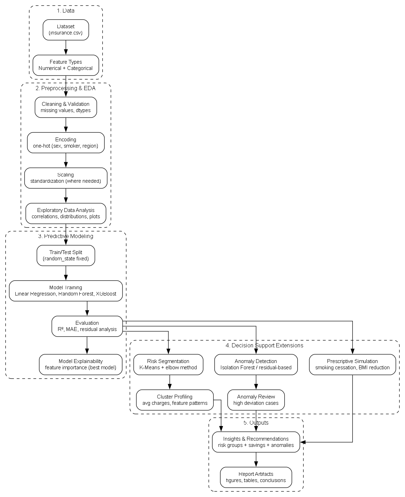
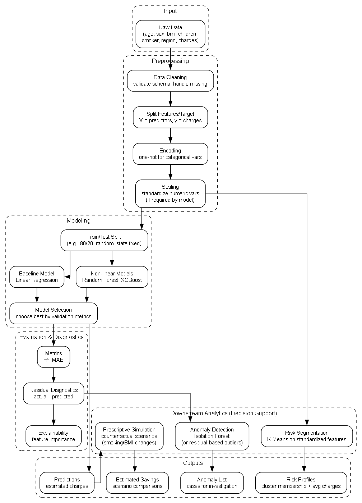

# Healthcare Cost Prediction and Risk Segmentation
**Project Type:** Academic Course Project (MSc Data Science)

This repository contains a machine learning and data analytics project developed as part of the MSc Data Science programme. The objective was to analyse healthcare insurance data, build predictive models for cost estimation, identify high-risk customer segments, and simulate cost-reduction interventions.

The project demonstrates a complete analytics workflow including exploratory data analysis, predictive modelling, clustering, anomaly detection, and prescriptive simulation.

---

# 📊 Problem Statement

Healthcare providers and insurers need to understand the factors driving medical costs in order to:

- predict future expenses,
- identify high-risk individuals,
- and design cost-reduction interventions.

Using historical insurance data, this project builds predictive models and segmentation approaches to support data-driven decision making.

---

# 🗂 Dataset

Source: Kaggle – Medical Cost Personal Dataset  
https://www.kaggle.com/datasets/mirichoi0218/insurance

Features include:

- age  
- sex  
- BMI  
- number of children  
- smoking status  
- region  
- insurance charges (target variable)

---

# 📊 Project Workflow and Machine Learning Pipeline

This section provides a visual overview of the complete analytics process followed in this project, from data acquisition to predictive modelling, segmentation, and anomaly detection.

## 🔄 End-to-End Project Workflow

The workflow diagram illustrates the overall sequence of steps involved in this project, including data preprocessing, exploratory analysis, model development, and business interpretation.



Key stages include:
- Data collection and loading
- Data cleaning and preprocessing
- Exploratory Data Analysis (EDA)
- Feature engineering and encoding
- Predictive modelling
- Model evaluation
- Segmentation and anomaly detection
- Interpretation and decision support

This structured approach ensures a systematic and reproducible machine learning workflow.

## ⚙️ Machine Learning Pipeline

The machine learning pipeline shows the detailed modelling and analytical components used to generate predictions and insights.



The project follows a structured analytics pipeline:

## 1. Exploratory Data Analysis (EDA)

- Distribution analysis of features
- Correlation analysis
- Identification of cost drivers
- Visualization of smoking and BMI impact

Tools:

- Pandas
- Matplotlib
- Seaborn

---

## 2. Predictive Modelling

Multiple regression models were implemented and compared:

### Linear Regression

Baseline model for cost prediction.

### Random Forest Regressor

Provided best performance:

- R² ≈ 0.86

### XGBoost Regressor

Used to compare performance with ensemble methods.

Evaluation metrics:

- R² score
- Mean Absolute Error (MAE)
- Mean Squared Error (MSE)

---

## 3. Customer Segmentation (Clustering)

K-Means clustering was applied to identify distinct customer groups.

Result:

- Cluster 0: Low-risk individuals
- Cluster 1: High-risk individuals (higher BMI, smoking, higher costs)

This segmentation can support targeted interventions.

---

## 4. Anomaly Detection

Isolation Forest was used to detect unusual or high-risk cases.

Purpose:

- Identify extreme medical cost patterns
- Detect potentially high-impact customers

---

## 5. Prescriptive Simulation (What-If Analysis)

Simulated cost-reduction interventions such as:

- Smoking cessation
- BMI reduction

Estimated potential healthcare cost savings.

This demonstrates how analytics can support decision-making beyond prediction.

## 🎯 Why This Workflow Matters

This pipeline demonstrates a complete end-to-end data science lifecycle, including:

- Predictive modelling
- Unsupervised learning
- Anomaly detection
- Business interpretation

It reflects real-world industry workflows used in healthcare analytics and insurance cost prediction.

---

# 🧠 Technologies Used

Programming Language:

- Python

Libraries:

- Pandas
- NumPy
- Scikit-learn
- XGBoost
- Matplotlib
- Seaborn

Environment:

- Jupyter Notebook

---

# 📈 Key Results

- Random Forest achieved best performance (R² ≈ 0.86)
- Smoking and BMI were major cost drivers
- Clustering identified high-risk customer segment
- Intervention simulation showed potential cost savings

---

# 🧪 How to Run

1. Clone repository:

```bash
git clone https://github.com/adhishnanda/healthcare-cost-prediction-analytics-course-project.git
```

2. Open notebook:

```bash
jupyter notebook
```

3. Run all cells.

---

📁 Repository Structure

```
healthcare-cost-prediction-analytics-course-project/
├── notebooks/
│ └── healthcare_cost_prediction.ipynb
│
├── figures/
│ ├── workflow.png
│ ├── ml_pipeline.png
│ ├── correlation_heatmap.png
│ ├── clustering.png
│ └── anomaly_detection.png
│
├── report/
│ └── Data_Analytics_HP_Report.pdf
│
├── requirements.txt
│
└── README.md
```

---

🎓 Academic Context

This project was completed as part of the MSc Data Science coursework.

The implementation, modelling, and analysis in this repository represent my individual technical work and learning.

---

🚀 Learning Outcomes

This project strengthened my understanding of:
- Machine learning regression models
- Feature importance analysis
- Clustering and segmentation
- Anomaly detection
- End-to-end analytics workflows

---

⚠️ Disclaimer

This is an academic course project intended for learning and portfolio purposes.

---

## Author

Adhish Nanda  
MSc Data Science, Berlin  
[LinkedIn](https://www.linkedin.com/in/adhishnanda)


